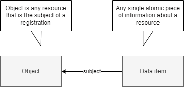

# Vocabulary

In order to provide metadata about any singular piece of information about a resource, we need to be able to talk about it and in turn capture data about it. The first notion we therefore introduce is the [=data element=]. Information objects we consume to draw insights from or base decisions on are comprised out of multiple atomic units of information, each captured by one attribute or association. Consider the following information object in JSON:

<pre>
{
  "omschrijving": "Laan van Westenenk 701, 7334DP Apeldoorn",
  "plaatsnaam": "Apeldoorn",
  "identificatie": "0200200000075716",
  "isHoofdadres": true,
  "huisnummer": 701,
  "postcode": "7334DP",
  "straatnaam": "Laan van Westenenk"
}
</pre>

Or, in RDF:

<pre>
&lt;http://example.com/id/adres/0200200000075716&gt; a gebouw:Adres;
  gebouw:postcode "7334DP";
  gebouw:huisnummer 701;
  gebouw:identificatie "0200200000075716";
  gebouw:omschrijving "Laan van Westenenk 701, 7334DP Apeldoorn";
  nen3610:registratiegegevens &lt;http://example.com/base/registratiegegevens-0200200000075716&gt;;
  gebouw:straatnaam "Laan van Westenenk";
  gebouw:plaatsnaam "Apeldoorn";
  gebouw:isHoofdadres true .
</pre>

Each data element can have its own lineage; its own algorithm to determine the given value. By treating these data elements as objects; allows us to describe and provide information about them. For instance to state that `{ "plaatsnaam": "Apeldoorn" }` is derived from a data element in the BAG. 
In the following diagram both the object and the data elements are modelled as an objecttype, as they are things; objects, we are interested in describing.



A data element is identified by it's 1) [=subject=] 2) [=value=] and 3) [=property=]
e.g.
```
{
    "property": "plaatsnaam",
    "value": {
        "stringValue": "Apeldoorn"
    },
    "subject": {
        "identificatie": "0200200000075716",
        "domein": null
    }
}
```

| Term                    | Definition                                                               |
| ----------------------- | ------------------------------------------------------------------------ |
| <dfn>object</dfn>       | An object is any resource that is the subject of a registration.         |
| <dfn>data element</dfn> | A data element is any singular piece of information about a resource.    |
| <dfn>subject</dfn>      | A subject is an object a data element is about.                          |
| <dfn>property</dfn>     | A property is the characteristic of the subject a data element is about. |
| <dfn>value</dfn>        | The value of a data element.                                             |

Several subtypes of data elements are identified; but these are omitted in the following examples for simplicity's sake.


A data element can be described from different point of views. The perpective a lineage model would take is one of provenance. Questions to be answered include, for instance, where, how and by whom, is the statement `Building G0200.42b3d39246840268e0530a0a28492340 has construction date 2006` created? Other models could address other aspects of a data element; for instance whether it is subject to an examination of correctness (which could be relevant for the BAG: https://catalogus.kadaster.nl/bag/nl/page/InOnderzoek) or what is the quality of a data element. 

A data element is part of the information object describing an object; but this is omitted in the following examples.


This gives a basic model applicable for any usecase where metadata about data elements is of importance.

