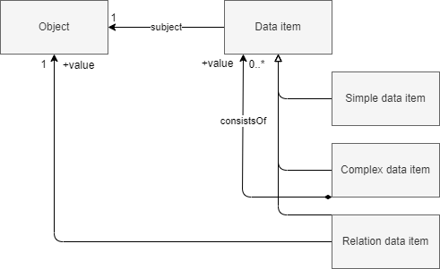

# Vocabulary


In order to provide metadata about any singular piece of data about a resource, we need to be able to talk about it and in turn capture data about it. The first notion we introduce is the [=data item=]. Data objects we utilize to draw insights from, or base decisions on, are comprised out of multiple atomic units of data, each captured by one attribute or association. Consider the following data object in JSON:

```json
{
  "omschrijving": "Laan van Westenenk 701, 7334DP Apeldoorn",
  "plaatsnaam": "Apeldoorn",
  "identificatie": "0200200000075716",
  "isHoofdadres": true,
  "huisnummer": 701,
  "postcode": "7334DP",
  "straatnaam": "Laan van Westenenk"
}
```

Or, in RDF:

```turtle
<http://example.com/id/adres/0200200000075716> a gebouw:Adres;
  gebouw:postcode "7334DP";
  gebouw:huisnummer 701;
  gebouw:identificatie "0200200000075716";
  gebouw:omschrijving "Laan van Westenenk 701, 7334DP Apeldoorn";
  nen3610:registratiegegevens <http://example.com/base/registratiegegevens-0200200000075716&gt>;
  gebouw:straatnaam "Laan van Westenenk";
  gebouw:plaatsnaam "Apeldoorn";
  gebouw:isHoofdadres true .
```

Each [=data item=] can have its own lineage; its own description of how and when it was created. Treating these [=data items=] as [=objects=]; allows us to describe and provide data about them. For instance to state that `{ "plaatsnaam": "Apeldoorn" }` is derived from a [=data item=] in the BAG. 
In the following diagram both the [=object=] and the [=data items=] are modelled as a type of [=object=], as they are things; [=objects=], we are interested in describing.


A [=data item=] is identified by its 1) [=subject=] 2) [=value=] and 3) [=property=]
e.g.

```json
{
  "property": "plaatsnaam",
  "value": {
    "stringValue": "Apeldoorn"
  },
  "subject": {
    "identificatie": "0200200000075716",
    "domein": null
  }
}
```

Several subtypes of [=data item=] are identified; but these are omitted in the following examples for simplicity's sake.



<aside class="note" title="Data item vs. Data element">
A data item is a distinct piece of data that describes an atomic state of a particular object concerning a specific property at a certain time point [[UDT]][[NTM]]. For example, the height of John Doe is a data item that describes a property of John Doe at a particular time.

On the other hand, a <dfn>data element</dfn> is, generally, a concept forming part of a data model [[DCS]][[MIM]] . As an element of data representation, a collection of data elements forms a data structure. In [[ISO11179]] a data element is defined as `an <organization of data> unit of data that is considered in context to be indivisible. EXAMPLE The data element “age of a person” with values consisting of all combinations of 3 decimal digits.`. This may, however, also indicate a data item.

In this specification we see the [=data element=] as the type of similar [=data item=]s.
</aside>

A [=data item=] can be described from different points of view. The perspective a lineage model would take is one of provenance. Questions to be answered include, for instance, where, how and by whom, [=data items=] such as `Building G0200.42b3d39246840268e0530a0a28492340 has construction date 2006` are created. Other models could address other aspects of a [=data item=]; for instance whether it is subject to an examination of correctness (which could be relevant for the BAG: https://catalogus.kadaster.nl/bag/nl/page/InOnderzoek) or what is the quality of a [=data item=]. 

A [=data object=] is an [=object=] consisting of a contextually grouped set of [=data items=] about a particular [=object=]. [=Data objects=] could be represented as table rows or database records.


This gives a basic model applicable for any usecase where data about [=data items=] is of importance.

| Term                   | Definition                                                                                                                                            |
| ---------------------- | ----------------------------------------------------------------------------------------------------------------------------------------------------- |
| <dfn>object</dfn>      | An object is anything perceivable or conceivable.                                                                                                     |
| <dfn>data object</dfn> | A data object is an [=object=] consisting of a contextually grouped set of [=data items=] about a particular [=object=].                              |
| <dfn>data item</dfn>   | A data item is a distinct piece of data that describes an atomic state of a particular object concerning a specific property at a certain time point. |
| <dfn>subject</dfn>     | A subject is an [=object=] a [=data item=] is about.                                                                                                  |
| <dfn>property</dfn>    | A property is a feature of an [=object=].                                                                                                             |
| <dfn>value</dfn>       | The value of a [=data item=].                                                                                                                         |


